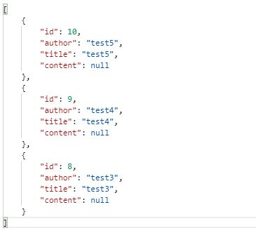
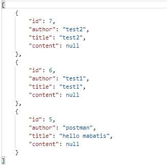
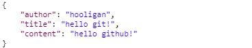
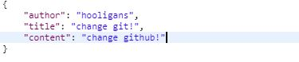
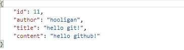

# &#128640; 커서 기반 페이징 게시판 구현
    java를 사용하여 json방식으로 결과를 제공하는 CRUD 기능과 커서 기반 페이징을 구현한 게시판입니다. 
### &#10065; 프로젝트 정보
* 프레임워크
  * Spring Boot
  * mybatis
* 라이브러리
  * lombok
* 데이터베이스
  * MySQL
* 빌드 툴
  * Maven

### &#10065; 사용 예제
 ##### 1. 게시물 목록 조회
    GET : localhost:8080/boards/?page=1
    GET : localhost:8080/boards/?page=2&cursor=8

 * 첫 번째 페이지 요청 시에는 RequestParam로 page만을 가져옵니다.
 * 두 번째 페이지 요청부터는 이전 페이지의 가장 작은 인덱스를 cursor의 값으로 지정하여 요청합니다.
 ##### 2. 게시물 추가
    POST : localhost:8080/boards/
    PUT : localhost:8080/boards/

  * 위와 같이 JSON 형식의 데이터를 HTTP메소드 BODY에 실어서 요청을 하면 데이터베이스에서는 내용을 입력한다.
  * index를 주입하지 않는 이유는 기본키로 auto_increment 설정을 했기 때문에 DB에 행이 추가되면 자동으로 입력된다.
 ##### 3. 게시물 조회
    GET : localhost:8080/boards/11

  * 게시물의 Index를 통하여 DB에서 해당 객체를 열람할 수 있다.
